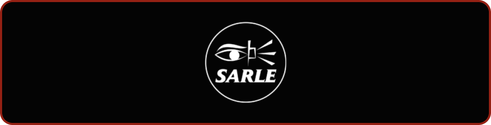

# PROJETO
A Sarle é um produtura dedicada a criar experiências imersivas e modernas que encantam o público e dão vida a histórias únicas. Especializado em storytelling visual e produção audiovisual, a Sarle combina inovação e estratégia para entregar projetos personalizados que destacam a essência de cada marca ou artista com quem trabalha.

O site da Sarle foi projetado para refletir essa visão criativa, oferecendo uma navegação responsiva, moderna e intuitiva. Com um design pensado para otimizar a experiência do usuário, o site apresenta o portfólio da empresa de forma envolvente e acessível, destacando os projetos realizados e as soluções criativas desenvolvidas ao longo de sua trajetória. Cada detalhe do site foi planejado para conectar visitantes à essência da Sarle, mostrando como a empresa transforma ideias em narrativas visuais memoráveis.

<br>    

# INSTRUÇÕES
1. Em um terminal, clonar o repositório:
```bash
git clone https://github.com/Z4ffarani/Sarle.git
```

2. No terminal, navegar até a pasta do projeto:
```bash
cd Sarle/sarle
```

3. No terminal, instalar o pacote de módulos do Node.js:
```bash
npm install
```

4. Iniciar o servidor de desenvolvimento:
```bash
npm run dev
```

5. Acessar o site no endereço: **http://localhost:5173**

<br>

# FUNÇÕES
- **Interface convidativa** | O site oferece uma interface visualmente organizada, com elementos animados e estilizados para aprimorar a experiência do usuário.

- **Navegação dinâmica** | Utiliza uma estrutura de rotas que permite aos usuários navegar de forma fluida entre as seções, proporcionando uma transição suave entre páginas.

- **Compatibilidade com diferentes dispositivos** | O layout responsivo se adapta a várias resoluções de tela, oferecendo uma experiência consistente em desktops, tablets e smartphones.

<br>

# OBSERVAÇÕES
- Todos os direitos do site são reservados à Sarle.

- É necessária a instalação do Node.js para rodar o projeto localmente.

- O site é responsivo, oferecendo uma experiência ajustada para diferentes dispositivos, o que garante que o conteúdo seja acessível em smartphones, tablets e desktops.

- Algumas funcionalidades avançadas de animação foram incorporadas para tornar a navegação mais envolvente e refletir a identidade visual da Sarle.

<br>

# TECNOLOGIAS
[](https://vitejs.dev)
[](https://react.dev)
[](https://tailwindcss.com/docs/installation)
[](https://nodejs.org/en/download/source-code)
[](https://www.npmjs.com/package/react-router-dom)
[](https://vercel.com/)
